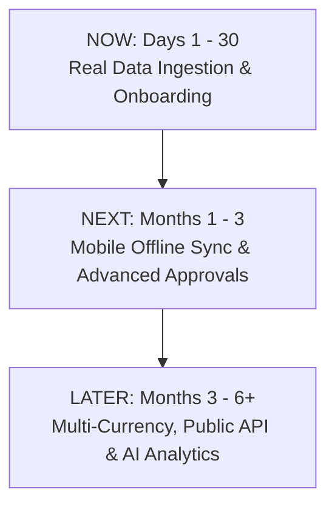

# SKB Works Portal — Future Roadmap & Upgradation Master Plan

> **Portal Domain:** [https://skbportal.online](https://skbportal.online)  
> **Repository:** [https://github.com/dhshishirD/skb-portal](https://github.com/dhshishirD/skb-portal)

---

## 🌟 At-A-Glance Upgradation Plan

---

## 📅 Phased Execution Roadmap

### 1. NOW (Next 30 Days) — Data Ingestion & Operational Onboarding
- **Team Password Setup & MFA Enforcement**: Enable secure login, role-tailored dashboards, and 2FA TOTP for Super Admin & Executive accounts.
- **2026 Project & Grant Data Migration**: Import all actual 2026 SKB projects, grant allocations, budgets, and beneficiary targets from legacy Excel files.
- **Executive Assignment Engine**: Executive Director assigns projects directly to Program Officers with automated notification alerts.
- **100% Spreadsheet Sunsetting**: Mark Excel files as read-only and enforce portal-only operations.

### 2. NEXT (1 – 3 Months) — Advanced Field Sync & Financial Controls
- **IndexedDB Mobile Offline Sync**: Field officers in Cox's Bazar, Kurigram, and Sylhet collect data offline with automatic background sync upon re-connecting to 3G/4G/WiFi.
- **Multi-Level Approval Chains**: Multi-tier threshold approval rules for procurement requests over ৳100,000 BDT.
- **Real-Time Notification Center**: Push notifications for expense claim status changes, task deadlines, and donor report submissions.

### 3. LATER (3 – 6+ Months) — Multi-Currency & Automated Donor Reporting
- **Multi-Currency Converter (USD / BDT / EUR / SAR)**: Support international donor reporting with real-time exchange rate tracking.
- **AI Narrative Generator v2**: Automated draft generation for UNHCR, EU, and USAID grant progress reports.
- **External Partner & Auditor Portal**: Time-restricted, read-only audit access for external financial auditors and donor evaluators.

---

## 🔒 Security & Compliance Architecture

- **Row Level Security (RLS)**: PostgreSQL level isolation ensuring users can only read/write records permitted by their role.
- **Multi-Tenant Isolation**: Complete isolation of HQ staff, field officers, and donor accounts.
- **Audit Logging**: Immutable action history tracking all project edits, budget approvals, and beneficiary additions.
