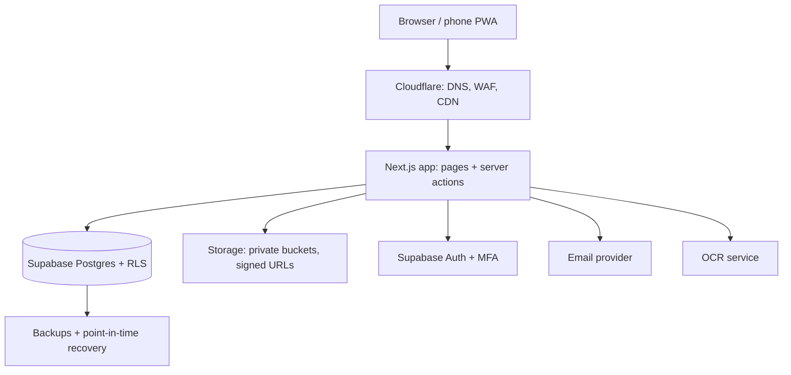

# NGO Works Portal - Full Brief (single file)

> Contains AGENTS.md rules, all docs, and the database migration. If your tool supports files, prefer the zip kit.


---
<!-- FILE: AGENTS.md -->
# AGENTS.md - NGO Works Portal

You are the lead engineer's assistant on an internal NGO operations portal. The human owner is a project programmer who is NOT an expert developer. Explain what you do in plain language, keep changes small, and never guess about security.

## What we are building
A secure web portal (works on phones, offline-capable for field staff) where HQ, project staff, finance, M&E, field officers, donors and implementing partners manage projects, grants, budgets, approvals, field reports and donor reporting. Full details are in /docs. READ THESE FIRST, in order:
1. docs/01-requirements.md  2. docs/02-roles-permissions.md  3. docs/03-architecture.md
4. docs/04-database.md  5. docs/05-workflows.md  6. docs/06-security.md  7. docs/07-roadmap.md
Current phase and status live in DECISIONS.md. Work ONLY on the current phase.

## Stack (do not swap without asking)
TypeScript (strict), Next.js App Router, Tailwind CSS, shadcn/ui, Supabase (Postgres, Auth, Storage) with SQL migrations in /supabase/migrations, generated DB types, Zod for validation, react-hook-form, next-intl (en + bn), TanStack Query, Vitest, Playwright, pnpm, GitHub Actions. Offline field forms: PWA (Serwist) + IndexedDB (Dexie). Hosting is decided later (Vercel or Cloudflare): keep server code portable, no filesystem writes, no long-running processes.

## Non-negotiable rules
### Security
- Every table has Row Level Security ENABLED with explicit policies. Deny by default. No table ships without RLS and a test proving another user cannot read it.
- Authorization lives in the DATABASE (RLS + helper functions), not only in the UI. Hiding a button is never security.
- Never put secrets in code. Use env vars; keep .env.local out of Git; the service-role key is server-only and never imported into client components.
- Public sign-up is disabled. Users are invited by an admin. Roles come only from the user_roles table, never from user-editable metadata.
- Validate all input with Zod on the server. Escape/encode output. Uploads: check type and size, store in private buckets, serve via short-lived signed URLs.
- Sensitive beneficiary fields (national ID, phone, address) are access-restricted and never logged.
- Separation of duties: the person who submits a claim cannot approve it (enforced in DB).
- Never disable RLS, weaken a policy, or use the service role "to make it work". If blocked, stop and ask.

### Database
- Change the schema ONLY through new migration files (supabase/migrations/NNNN_name.sql). Never edit an applied migration.
- Every table: id uuid pk, created_at, created_by, updated_at; soft delete (deleted_at) for business data; no hard deletes.
- Money: numeric(14,2) plus a 3-letter currency code. Never floats. Store the exchange rate used, per transaction.
- Every important change is captured in audit_log (append-only).
- After a migration: run db reset, regenerate types (pnpm db:types), run tests.

### Code quality
- Small pull-request-sized changes: one feature slice at a time (database -> server -> UI -> tests).
- No `any`. No unused code. No copy-pasted logic: shared logic goes in src/lib.
- Server actions/services in src/server; permission checks go through src/lib/permissions.ts only.
- Every feature ships with tests: unit (Vitest), RLS/database tests, and an end-to-end test for critical flows.
- Do not add a dependency without saying why. Prefer well-known, maintained packages.

### UX
- Mobile-first, works on low-end Android and slow networks. Keep pages light, compress images before upload.
- All user-facing text goes through next-intl (English and Bangla). No hardcoded strings.
- Accessible: labels, keyboard support, sufficient contrast. Dates in local format; timezone Asia/Dhaka displayed, stored UTC.
- Clear empty states, loading states, and error messages a non-technical officer can act on.

## Folder structure
```
AGENTS.md  DECISIONS.md  docs/  e2e/  .github/workflows/ci.yml
supabase/{migrations,seed.sql,tests,config.toml}
src/app/{(auth),(staff),(field),(donor),api}
src/components/{ui,features}
src/lib/{supabase,permissions,money,i18n,offline,database.types.ts}
src/server/{actions,services}
src/messages/{en.json,bn.json}
```

## Commands (create these package.json scripts)
pnpm dev | lint | typecheck | test | test:e2e | build | db:start | db:reset | db:types
CI runs lint, typecheck, test, build on every pull request.

## Workflow every task
1. Restate the task and list the files you will change. For anything touching auth, RLS, money or approvals, WAIT for the owner's OK on the plan.
2. Implement the smallest working slice on a feature branch (never commit to main).
3. Run lint, typecheck, tests. Fix failures. Do not skip or delete tests to pass.
4. Summarize in plain English: what changed, how to try it, what could go wrong.
5. Append a one-line entry to DECISIONS.md for any decision that a future reader would question.

## Definition of done
Works on mobile width; RLS + tests in place; audit logging where relevant; strings translated (en/bn); docs updated; no secrets; CI green; owner has tried it on staging.

## When unsure
Ask one clear question. Never invent business rules: if a rule is missing from /docs, propose it in DECISIONS.md and ask.

---
<!-- FILE: docs/00-START-HERE.md -->
# START HERE - how to use this kit

1. Create a private GitHub repo. Copy this whole kit into it (AGENTS.md at the root, docs/ folder, supabase/, .github/).
2. Open the folder in Antigravity. AGENTS.md at the project root is read automatically as a workspace rule (keep it under 12,000 characters).
3. Turn on protections in GitHub: branch protection on main, require CI to pass, Dependabot alerts, secret scanning.
4. Create two Supabase projects: staging and production (region closest to your users). Disable public sign-ups in Auth settings. Turn on MFA.
5. Work in Planning mode. Keep approval on for terminal commands that touch git, the database or deployments.
6. Paste prompts from docs/08-prompts.md ONE AT A TIME, in order. After each: review the plan, let it work, try it on staging, then merge the pull request.
7. Before every merge, ask a second AI session to review the pull request (prompt R1 in docs/08-prompts.md).
8. Keep DECISIONS.md updated. It is your memory and your handover document.

Golden rules for a non-expert owner:
- Never let the agent skip tests or RLS "to save time".
- Never paste real secrets or real beneficiary data into any AI chat.
- If you do not understand something, ask: "Explain this like I am new to programming."
- Hire a senior reviewer part-time and commission a penetration test before go-live.

Kit contents: AGENTS.md (agent rules) - DECISIONS.md (status/log) - docs/01..08 - supabase/migrations/0001_foundation.sql - .github/workflows/ci.yml - .env.example

---
<!-- FILE: docs/01-requirements.md -->
# 01 - Product requirements

## Purpose
One secure internal platform so HQ, project staff, finance, M&E, field officers, donors and implementing partners run projects, grants, approvals and reporting without scattered spreadsheets.

## Users
Staff at HQ and field offices across Bangladesh, external donor contacts (read-only), implementing partners (submit reports/expenses), temporary auditors. Many field users are on mid-range Android phones with weak connectivity.

## Goals
- One source of truth for projects, grants, budgets, indicators, reports.
- Faster, auditable approvals (expenses, procurement, reports).
- Field data captured offline and synced.
- Donor-ready reports generated from real data.
- Full audit trail; least-privilege access.

## Non-goals (for now)
HR/payroll, accounting general ledger, replacing dedicated survey tools (integrate KoboToolbox/ODK later), public website.

## Modules and priority
| # | Module | Phase |
|---|---|---|
| 1 | Login, MFA, invites, roles, per-project access | 1 |
| 2 | Master data: organizations, donors, grants, projects, partners, locations (Division > District > Upazila > Union > Village) | 1-2 |
| 3 | Project lifecycle board (Kanban) with stage gates | 2 |
| 4 | Logframe: Goal > Outcome > Output > Activity > Indicator | 2 |
| 5 | Work plan and tasks | 2 |
| 6 | Document library with versions and templates | 2 |
| 7 | Field reports (mobile PWA, offline, photos, GPS) | 3 |
| 8 | Budgets and grant tracking (burn rate, deadlines) | 3 |
| 9 | Expense claims and receipt upload with OCR suggestion | 3 |
| 10 | Approval workflows (generic engine) | 3 |
| 11 | Notifications (in-app, email) | 3 |
| 12 | Audit log viewer | 1 (log) / 3 (viewer) |
| 13 | Donor portal (read-only per donor) | 4 |
| 14 | M&E dashboards and maps | 4 |
| 15 | Report generator (Word/PDF/Excel in donor formats) | 4 |
| 16 | Beneficiary registry (consent, dedup, restricted) | 5 |
| 17 | Procurement (requests, quotations, PO, vendors) | 5 |
| 18 | Multi-currency and Bangla/English | 1 (i18n base) / 4 |

## Non-functional requirements
- Security: RLS on all tables, MFA for Finance/Admin/Executive, encryption, audit log, backups with quarterly restore test.
- Performance: main pages usable on 3G; first load under ~3 s on mid-range Android; images compressed client-side before upload.
- Availability: target 99.5%; daily backups + point-in-time recovery.
- Offline: field forms usable with no signal; sync when online; no data loss; idempotent sync.
- Accessibility: keyboard, labels, contrast. Languages: English, Bangla (donor pages may add others).
- Data: timestamps stored UTC, shown Asia/Dhaka; money as numeric + currency; soft deletes.
- Observability: error tracking (Sentry), uptime checks, basic usage metrics.
- Compliance: consent for beneficiary data, retention rules, respect donor data-location clauses.

## Success measures
- 90% of expense claims processed in the portal within 3 months of launch.
- Time to compile a donor report cut by at least half.
- Zero cross-project data exposure in penetration test.

---
<!-- FILE: docs/02-roles-permissions.md -->
# 02 - Roles and permissions

Three questions decide access: WHO you are (login/MFA), WHAT you can do (role), WHICH records you can see (assignments). All three are enforced in the database (RLS).

## Roles
super_admin, executive, programme_manager, project_officer, field_officer, finance, procurement, me_officer, donor, partner, auditor. A user can hold several roles; permissions add up, record scope stays tied to assignments.

## Scope rules
- executive: all projects and grants (read).
- staff roles: only projects in user_project_access (and, for field officers, locations in user_location_access).
- donor: only grants whose donor_org_id equals the user's organization; only approved/published reports.
- partner: only projects/activities they are assigned to.
- auditor: read-only, only through access rows that have expires_at set.
- super_admin: manages users, roles, settings, audit log. Sees system data, NOT business data (least privilege).

## Matrix (V view, E create/edit, A approve/validate, - none)
| Role | Scope | Projects | Field reports | Budget/expenses | Approvals | Donor reports |
|---|---|---|---|---|---|---|
| super_admin | System only | V | - | - | - | - |
| executive | Everything | V | V | V | A (high value) | V |
| programme_manager | Own projects | E | A | V | A | A |
| project_officer | Assigned | E | E | V | - | E |
| field_officer | Own area | V | E | E (own claims) | - | - |
| finance | Assigned grants | V | V | E | A | V |
| procurement | Assigned | V | - | E (purchase requests) | - | - |
| me_officer | Assigned | V | A (validate) | - | - | E |
| donor | Own grants | V | V (approved) | V (summary) | - | V |
| partner | Own activities | V | E | E | - | - |
| auditor | Time-limited | V | V | V | V | V |

## Separation of duties (enforced in DB, not only UI)
- Submitter of an expense/purchase/report cannot approve it.
- The same person cannot approve two consecutive steps of one workflow.
- Finance who verifies a claim cannot be its submitter.
- Users cannot change their own roles or project access.
- Role and access changes are audit-logged.

## Permission keys (used in src/lib/permissions.ts)
project.read, project.write, logframe.write, task.write, document.write, field_report.submit, field_report.review, field_report.validate, budget.read, budget.write, expense.submit, expense.verify, expense.approve, procurement.write, donor_report.write, donor_report.approve, donor_portal.read, beneficiary.read, beneficiary.write, user.manage, audit.read.
The UI uses these keys to show/hide features; the database remains the real gate.

## Approval thresholds (configurable table approval_rules)
Steps by amount and currency, e.g. up to X: PM > Finance; above X: PM > Finance > Director/Executive. Thresholds are settings, not code.

## Acceptance tests (must exist before Phase 1 sign-off)
1. Field officer A cannot read Project B's rows.
2. Donor 1 cannot read Donor 2's grants or projects.
3. Auditor loses access when expires_at passes.
4. A user cannot insert/update their own user_roles or user_project_access.
5. A deactivated user (is_active=false) sees nothing.
6. Anonymous requests see nothing on any table.
7. audit_log cannot be updated or deleted by any app role.
8. A user cannot change their own org_id or is_active.

---
<!-- FILE: docs/03-architecture.md -->
# 03 - Architecture



## Layers
1. Edge: Cloudflare (DNS, CDN, WAF, DDoS, Turnstile on login). Optional Cloudflare Access on admin routes.
2. App: Next.js App Router, server actions/services for writes, server components for reads.
3. Data: Postgres with RLS; Storage for files; Auth for identity/MFA.
4. Integrations: email (Resend/Postmark), OCR (Google Vision/Azure or LLM vision; result is a SUGGESTION, human confirms), later KoboToolbox/ODK.

## Environments
Local (Supabase CLI) > Preview (per pull request) > Staging (production-like, fake data) > Production. Separate Supabase projects and secrets for staging and production. Never test on production data.

## Auth and authorization flow
Request > Cloudflare > login (Supabase Auth, MFA) > app checks permission key > query runs as the USER (anon key + user JWT) so RLS applies > audit trigger records changes. The service-role key is used ONLY in server-side admin tasks (invite user, assign role) after an explicit permission check, and such tasks must record the actor (set app.actor_id) so the audit log names the human.

## Offline field flow
Form saved to IndexedDB with a client-generated UUID > sync queue retries when online > server upserts idempotently by UUID > conflicts: drafts last-write-wins; submitted reports are immutable except via "return for correction". Photos compressed on device, uploaded in background.

## Key conventions
- Route groups: (auth), (staff), (field), (donor). Layout per group enforces the role area, but RLS is the real gate.
- Errors: user-friendly message + Sentry event; never leak SQL or stack traces.
- Files: private buckets, path = project_id/record_id/filename, signed URLs expire in minutes, virus/type/size checks.
- Jobs: reminders, deadline alerts, report builds via Supabase cron/queue.
- i18n: next-intl with en.json and bn.json; Bangla numerals optional per user setting.

## Hosting decision (record in DECISIONS.md)
A) Vercel + Cloudflare in front: smoothest for Next.js. B) Cloudflare Workers via OpenNext: single vendor, needs care with Node APIs. C) VPS + Docker: only with a DevOps person. Keep code portable until decided.

## Backup and recovery
Daily backups + point-in-time recovery on production. Quarterly restore drill to a scratch project, documented in docs/runbook.md. Target RPO under 24 h (better with PITR), RTO under 4 h.

---
<!-- FILE: docs/04-database.md -->
# 04 - Database design

Source of truth = supabase/migrations. Migration 0001_foundation.sql (already written and tested) creates: organizations, profiles, user_roles, locations, grants, projects, user_project_access, user_location_access, audit_log, helper functions (has_role, has_any_role, can_access_project, can_access_grant, is_internal_user, current_org_id, is_active_user), audit triggers, and all RLS policies. Test file: supabase/tests/rls_foundation.sql (12 checks, all must pass).

## Rules for every new table (copy into each migration)
```sql
-- 1) columns: id uuid pk default gen_random_uuid(), created_at, created_by default auth.uid(), updated_at, deleted_at (business data)
-- 2) alter table public.X enable row level security;
-- 3) revoke all on public.X from anon;
-- 4) explicit select/insert/update policies using can_access_project(project_id) and has_role/has_any_role
-- 5) audit trigger: create trigger audit_X after insert or update or delete on public.X for each row execute function public.log_audit();
-- 6) updated_at trigger; indexes on every foreign key
-- 7) add RLS tests to supabase/tests
```
Note: Supabase re-grants table privileges to anon/authenticated for new tables, so step 3 is mandatory.

## Planned tables by phase (columns abbreviated; all include the standard columns above)
### Phase 2 - Project core
- project_stage_history(project_id, from_stage, to_stage, changed_by, note)
- stage_gate_items(project_id, stage, label, done, done_by, done_at)
- logframe_nodes(project_id, parent_id, kind[goal|outcome|output|activity], code, title, description)
- indicators(node_id, name, unit, baseline, target, frequency, means_of_verification, disaggregation jsonb)
- indicator_values(indicator_id, period_start, period_end, value, location_id, source_report_id, validated_by, validated_at)
- tasks(project_id, node_id, title, assignee_id, due_date, status[todo|doing|blocked|done], priority)
- task_comments(task_id, body)
- documents(project_id, title, category, current_version_id) and document_versions(document_id, storage_path, mime, size, version_no, uploaded_by)
### Phase 3 - Field and finance
- field_reports(id uuid client-generated, project_id, location_id, reporter_id, period, status[draft|submitted|under_review|validated|approved|returned], payload jsonb, gps point, submitted_at, client_created_at)
- field_report_attachments(report_id, storage_path, mime, size)
- budget_lines(project_id, grant_id, code, description, amount, currency)
- expenses(id, project_id, budget_line_id, claimant_id, amount, currency, fx_rate_to_bdt, expense_date, description, status, submitted_at)
- receipts(expense_id, storage_path, ocr_json, ocr_confirmed_by)
- approval_rules(scope, currency, min_amount, max_amount, steps jsonb) -- thresholds are data, not code
- approvals(subject_type, subject_id, step_no, required_role, status[pending|approved|rejected|returned], actor_id, acted_at, comment)
- notifications(user_id, kind, payload jsonb, read_at, email_sent_at)
- exchange_rates(currency, rate_to_bdt, valid_from, source)
### Phase 4 - Donor and M&E
- donor_report_templates(donor_org_id, name, format, definition jsonb)
- donor_reports(grant_id, template_id, period, status[draft|pm_approved|published], file_path, published_at)
- dashboards_config (optional), saved_views
### Phase 5 - Beneficiaries and procurement
- beneficiaries(project_id, location_id, full_name_enc, national_id_enc, phone_enc, sex, birth_year, vulnerability jsonb, consent_at, consent_by) -- sensitive columns encrypted; access restricted by role AND project AND location
- beneficiary_participation(beneficiary_id, activity_id, date, service)
- vendors, purchase_requests, quotations, purchase_orders, goods_receipts

## Conventions
- Money: numeric(14,2) + currency char(3); also store fx_rate used. Never float.
- Dates: date for calendar dates, timestamptz for moments (UTC).
- Enums for closed sets that rarely change; lookup tables for sets admins edit.
- Soft delete via deleted_at; policies hide deleted rows.
- Idempotent client writes: client-generated uuid primary keys for offline data.
- Storage buckets: private; policies mirror table access (path starts with project_id).
- Migrations: forward-only, one concern each, reviewed before apply. Production migrations run only from CI/approved step, after a backup.

---
<!-- FILE: docs/05-workflows.md -->
# 05 - Workflows and business rules

## A. Project lifecycle (Kanban)
Stages: concept > proposal > approved > implementation > monitoring_evaluation > closed.
Gate to advance (all items ticked and approver role acts):
- concept > proposal: concept note document attached; donor/grant identified (or marked "unfunded").
- proposal > approved: logframe complete; budget lines sum to grant amount; PM approval; executive approval above threshold.
- approved > implementation: work plan exists; team assigned; grant agreement uploaded.
- implementation > monitoring_evaluation: baseline indicator values captured.
- monitoring_evaluation > closed: final report approved; expenses reconciled; documents archived.
Moving backwards requires a reason (logged). Every move writes project_stage_history.

## B. Expense claim (approval workflow)
States: draft > submitted > pm_approved > finance_verified > director_approved > paid; side exits: returned (to claimant with reason), rejected (final), cancelled (by claimant before approval).
1. Field officer creates claim, attaches receipt photo; OCR proposes date/amount/vendor; claimant confirms or corrects (human always confirms).
2. System checks: budget line has remaining balance; receipt required above small-amount limit; date within project period; duplicate receipt detection (same amount+date+vendor).
3. Steps come from approval_rules by amount and currency. Example: <= X: PM > Finance; > X: PM > Finance > Director/Executive.
4. Each step records actor, timestamp, comment. Actor must differ from submitter and from the previous step's actor (DB constraint/trigger).
5. Pending longer than N days: reminder to approver, then escalate to their manager.
6. On final approval: budget line "committed" updates; Finance marks paid with payment reference; burn rate updates.
7. Returned claims keep history; resubmission creates a new step cycle, same claim id.

## C. Field report (offline)
States: draft (device only) > submitted > under_review (Project Officer) > validated (M&E, indicators checked) > approved (PM) | returned.
- Client generates the UUID; sync is an idempotent upsert.
- Submitted reports are immutable; corrections only via "returned".
- Photos are compressed on device; GPS and client timestamp stored; server timestamp is authoritative for ordering.
- Validated values feed indicator_values automatically; M&E can adjust with a logged reason.

## D. Grant tracking
- Grant has budget lines, reporting deadlines, donor contact org.
- Burn rate = spent / total; also committed; forecast by monthly run-rate.
- Alerts: 60/30/7 days before report deadlines; overspend > 90% of a budget line; grant end approaching with high unspent balance.

## E. Donor reporting
Compile from validated indicators + approved financials for the period > generate in donor template (Word/PDF/Excel) > PM approves > publish to donor portal. Donors see only published reports for their own grants. Republishing creates a new version; old versions kept.

## F. Procurement (Phase 5)
Purchase request > (quotations, min 3 above threshold) > comparison sheet > approval by role/amount > PO > goods received > invoice matched > payment. Vendor list with blacklist flag.

## G. Users and access
Admin invites by email > user sets password + MFA > admin assigns org, roles, projects/locations (with optional expiry) > every change audit-logged. Leavers: deactivate (is_active=false), never delete. Access reviews quarterly: list of who can see what.

## H. Notifications
In-app + email for: pending approval, returned/rejected item, deadline reminders, report published. User can choose language (en/bn). No sensitive data inside email bodies; link to the portal.

## I. Data quality rules (examples)
Required fields by report type; numeric ranges for indicators; location must be within assigned area; duplicate beneficiary detection by normalized name + birth year + location + phone hash.

---
<!-- FILE: docs/06-security.md -->
# 06 - Security and compliance checklist

## Identity
- [ ] Invite-only accounts; public sign-up disabled
- [ ] MFA required for super_admin, executive, finance, programme_manager; recommended for all
- [ ] Strong password policy, leaked-password check on, session timeout, logout everywhere on deactivation
- [ ] Turnstile + rate limiting on login and password reset

## Authorization
- [ ] RLS enabled on EVERY table, tests prove isolation (supabase/tests)
- [ ] Roles only from user_roles; never from client metadata
- [ ] Separation of duties enforced in DB triggers/constraints
- [ ] Service-role key used only in server code, after permission check, with app.actor_id set
- [ ] Quarterly access review

## Data protection
- [ ] HTTPS only, HSTS; data encrypted at rest (managed)
- [ ] Beneficiary sensitive fields encrypted at column level; never in logs, analytics, emails or AI prompts
- [ ] Consent captured and stored per beneficiary; retention and deletion policy written
- [ ] Private storage buckets; signed URLs expire in minutes; file type/size checks
- [ ] Check Bangladesh data-protection requirements and each donor's data clauses (storage location, retention, breach notice)

## Application
- [ ] Zod validation on all server inputs; output encoding; CSRF protection on mutations
- [ ] Security headers/CSP via Next.js config and Cloudflare
- [ ] Dependency scanning (Dependabot), secret scanning, lockfile committed
- [ ] No secrets in repo; separate staging/production keys; rotation plan
- [ ] Rate limiting on expensive endpoints (OCR, report generation)

## Operations
- [ ] Daily backups + point-in-time recovery; quarterly restore drill logged
- [ ] Sentry alerts, uptime monitor, database usage alerts
- [ ] Audit log retention at least 7 years or donor requirement
- [ ] Incident response one-pager: who decides, how to revoke sessions/keys, how to notify donors and users
- [ ] Staff training: phishing, device loss, MFA recovery

## Before go-live (all mandatory)
- [ ] Independent penetration test and code security review; findings fixed and retested
- [ ] Load test with expected peak (e.g. month-end reporting)
- [ ] Disaster recovery drill completed
- [ ] Data protection impact review signed by the business owner
- [ ] Runbook and handover documentation complete (docs/runbook.md)

## AI-assisted development guardrails
- Review every AI change; second-AI review on every pull request (prompt R1).
- Never share real secrets, real beneficiary data or production dumps with any AI tool. Use fake seed data.
- The agent must not run destructive commands (drop, reset, force-push) against staging/production. Migrations to production only through the approved pipeline step.

---
<!-- FILE: docs/07-roadmap.md -->
# 07 - Roadmap, tasks and acceptance criteria

Rule: finish a phase completely (tests green, demo to real users, written sign-off) before starting the next. Estimates are part-time solo with AI assistance.

## Phase 0 - Discovery (2-3 weeks)
Tasks: interview 5-8 users (field, finance, PM, M&E, donor contact); collect current forms, spreadsheets, donor report formats; confirm role matrix; answer open questions in DECISIONS.md; wireframe 5 screens (dashboard, project board, field report, expense approval, donor view); choose hosting and Supabase region.
Done when: requirements and role matrix signed off by the business owner; wireframes reviewed by users.

## Phase 1 - Foundation (3-4 weeks)
Tasks:
1. Repo, branch protection, CI (lint, typecheck, test, build), Dependabot, secret scanning.
2. Next.js + TypeScript strict + Tailwind + shadcn/ui + next-intl (en/bn) scaffold; app shell with mobile navigation.
3. Supabase local setup; apply 0001_foundation.sql; generate types; run supabase/tests/rls_foundation.sql.
4. Auth: invite-only login, password set, MFA enrollment and enforcement for privileged roles, session handling, deactivate user.
5. Permission layer src/lib/permissions.ts (keys from docs/02) + route guards per group.
6. Admin screens: users (invite, assign org/roles/projects/locations with expiry, deactivate), organizations, locations import (Bangladesh hierarchy), audit log viewer.
7. Sentry, uptime check, staging environment, seed script with FAKE data.
Acceptance: all 8 acceptance tests in docs/02 pass; an invited user can log in with MFA; admin cannot see business data; CI green; deployed to staging.

## Phase 2 - Project core (4-5 weeks)
Tasks: grants and projects CRUD; project Kanban with stage gates and history; logframe editor (tree) with indicators; work plan/tasks with comments; document library with versions; project dashboard.
Acceptance: PM creates a project end-to-end; stage gates block invalid moves; field officer sees only assigned projects (test); documents private with signed URLs.

## Phase 3 - Field and finance (5-6 weeks)  [pilot with ONE real project]
Tasks: offline PWA field forms (IndexedDB queue, background sync, photo compression, GPS); field report review > validation > approval; budget lines and grant tracker (burn rate); expense claims with receipt upload and OCR suggestion; generic approval engine with approval_rules and separation of duties; notifications (in-app + email) and reminders; audit log viewer polish.
Acceptance: submit a report in airplane mode, sync later without loss or duplicates; expense follows approval chain; submitter cannot approve (test); burn rate matches finance spreadsheet within 0.01.

## Phase 4 - Donor and M&E (4-5 weeks)
Tasks: donor portal (per-donor scope, published reports only); M&E dashboards, district map, trends; report generator (Word/PDF/Excel) for each donor template; multi-currency views and exchange rates; Bangla polish.
Acceptance: donor A cannot see donor B (test); one real donor report generated from portal data and accepted by the program team.

## Phase 5 - Beneficiaries and procurement (4-5 weeks)
Tasks: beneficiary registry with consent, encryption, dedup, restricted access; participation tracking; procurement flow; vendor list.
Acceptance: dedup catches seeded duplicates; sensitive columns unreadable without permission; procurement chain enforced.

## Phase 6 - Hardening and launch (3-4 weeks)
Tasks: penetration test + fixes; load test; restore drill; accessibility pass; training (English + Bangla guides, videos, portal champions); data migration from spreadsheets with reconciliation; parallel run for one reporting cycle; go-live checklist (docs/06).
Acceptance: pen test has no open high/critical findings; restore drill documented; users trained; business owner signs go-live.

## Phase 7 - Support and growth (ongoing)
Monthly release cadence; feedback loop; KoboToolbox/ODK integration; WhatsApp/SMS alerts; AI assistant for drafting report narratives from validated data (with human review); partner API.

## Definition of done (every task)
Works at 360px width; RLS and tests; audit logging where relevant; en/bn strings; docs updated; CI green; reviewed by second AI; tried on staging by the owner.

---
<!-- FILE: docs/08-prompts.md -->
# 08 - Prompts for Antigravity (paste ONE at a time, in order)

Use Planning mode. Read the plan the agent produces before letting it edit files. After each prompt: try it, run tests, open a pull request, run review prompt R1 in a second session, then merge.

## P0 - Orientation (no code)
Read AGENTS.md and all files in /docs. Summarize in plain English what we are building, the current phase, and the top 5 risks. Propose the Phase 1 task list in order with a time estimate for each. Do not write code yet. List any question you need answered.

## P1 - Scaffold
Create the Next.js app (App Router, TypeScript strict, Tailwind, shadcn/ui, pnpm) in this repo. Add ESLint, Prettier, Vitest, and Playwright configured. Add the package.json scripts listed in AGENTS.md. Add next-intl with en and bn message files and a language switcher. Create the route groups (auth), (staff), (field), (donor) with placeholder layouts. Make the app shell mobile-first. Do not touch supabase/ or .github/. Show me how to run it.

## P2 - Database
Set up the Supabase CLI for local development (config.toml, db:start, db:reset, db:types scripts). Apply supabase/migrations/0001_foundation.sql without editing it. Run db reset, generate TypeScript types into src/lib/database.types.ts, then run supabase/tests/rls_foundation.sql and show me the output. If anything fails, explain the cause and propose a NEW migration; never edit 0001.

## P3 - Authentication
Implement invite-only authentication with Supabase Auth: login page, set-password page for invited users, logout, session refresh in middleware, password reset. Public sign-up must be impossible. Enforce MFA (TOTP) enrollment and verification for users with roles super_admin, executive, finance, programme_manager. Use the anon key with the user's session for all normal queries; the service-role key only in server-only modules. Write Playwright tests for login, wrong password, and MFA-required flow. Show the plan first.

## P4 - Permissions layer
Create src/lib/permissions.ts mapping roles to the permission keys in docs/02-roles-permissions.md, plus server helpers requirePermission(key) and a client hook usePermissions(). Add route guards per route group. Add unit tests for every role/permission pair from the matrix. Explain clearly that the database RLS remains the real gate.

## P5 - Admin: users and access
Build admin screens: invite user (email, full name, organization, roles), edit roles, assign projects and locations with optional expiry, deactivate/reactivate. Admin writes run in server actions using the service-role client AFTER requirePermission('user.manage'), and must set app.actor_id so the audit log records the acting admin. Add a screen to list the audit log with filters (table, actor, date). Add tests proving a non-admin cannot call these actions. Show the plan first.

## P6 - RLS test automation
Wrap supabase/tests/rls_foundation.sql so it runs with one command (pnpm test:db) and in CI against a local Supabase. Add tests for any new table from now on. Report what is covered and what is not.

## P7 - CI/CD and environments
Review .github/workflows/ci.yml, make it work with our scripts, and add: Playwright smoke test job, dependency audit, and a manual "promote to production" workflow that runs migrations only after a backup step and approval. Document staging vs production setup in docs/runbook.md (env vars, Supabase projects, domains). Do not deploy anything without my confirmation.

## P8 - Observability and hardening
Add Sentry (client + server), a /health endpoint, security headers/CSP, rate limiting on auth routes, and Cloudflare Turnstile on login. Document what I must configure in Cloudflare (WAF rules, HSTS) in docs/runbook.md.

## P9 - Seed data and demo
Create a seed script with FAKE data only: 1 internal org, 2 donors, 2 partners, one user per role, 3 grants, 4 projects, Bangladesh divisions and districts (sample). Provide a README section "How to log in as each role locally".

## Phase 2+ prompt pattern
"We are starting <module> from docs/<file>. First produce: (1) the data model as a NEW migration with RLS policies and audit triggers, (2) the RLS tests, (3) server services, (4) UI screens at 360px, (5) en/bn strings, (6) unit and Playwright tests. Show the plan and the migration for my approval before writing UI."

## Review and safety prompts
### R1 - Second-AI pull request review (use a fresh session or another model)
Review this pull request as a skeptical senior security engineer. Check: RLS on every new table and policies correct and tested; any use of the service-role key; secrets; input validation; separation of duties; audit logging; money handling; offline/idempotency issues; accessibility and mobile; missing tests. List issues by severity with file and line, and a concrete fix for each. Do not rewrite the code.

### R2 - RLS attack review
Act as a malicious authenticated user with role <role> assigned only to project <A>. Try to list ways to read, modify or delete data from project <B>, escalate privileges, or forge approvals given the current migrations. For each idea, show the SQL you would try and whether the current policies block it. Then propose tests for any gap.

### R3 - Explain to me
Explain what you just changed as if I am new to programming: what each file does, why it is needed, what could break, and how I can check it works.

### R4 - Before merge checklist
Verify: tests pass, lint/typecheck clean, no secrets, migrations are new files only, RLS tests updated, en/bn strings added, DECISIONS.md updated. Report pass/fail per item.

---
<!-- FILE: supabase/migrations/0001_foundation.sql -->
```sql
-- 0001_foundation.sql
-- Foundation: enums, core tables, helper functions, Row Level Security, audit log.
-- Deny by default: no table is readable/writable without an explicit policy.

-- ===== Enums =====
create type public.app_role as enum (
  'super_admin','executive','programme_manager','project_officer','field_officer',
  'finance','procurement','me_officer','donor','partner','auditor'
);
create type public.org_type as enum ('internal','donor','implementing_partner');
create type public.project_stage as enum (
  'concept','proposal','approved','implementation','monitoring_evaluation','closed'
);
create type public.grant_status as enum ('draft','active','closed');
create type public.location_level as enum ('division','district','upazila','union','village');

-- ===== Utility =====
create or replace function public.set_updated_at()
returns trigger language plpgsql set search_path = '' as $$
begin
  new.updated_at = now();
  return new;
end $$;

-- ===== Tables =====
create table public.organizations (
  id uuid primary key default gen_random_uuid(),
  name text not null,
  type public.org_type not null,
  country text,
  is_active boolean not null default true,
  created_at timestamptz not null default now(),
  created_by uuid default auth.uid() references auth.users(id),
  updated_at timestamptz not null default now()
);

create table public.profiles (
  id uuid primary key references auth.users(id) on delete cascade,
  org_id uuid references public.organizations(id),
  full_name text not null default '',
  phone text,
  language text not null default 'en' check (language in ('en','bn')),
  is_active boolean not null default true,
  created_at timestamptz not null default now(),
  updated_at timestamptz not null default now()
);

create table public.user_roles (
  user_id uuid not null references public.profiles(id) on delete cascade,
  role public.app_role not null,
  granted_by uuid default auth.uid() references auth.users(id),
  created_at timestamptz not null default now(),
  primary key (user_id, role)
);

create table public.locations (
  id uuid primary key default gen_random_uuid(),
  parent_id uuid references public.locations(id),
  level public.location_level not null,
  name_en text not null,
  name_bn text,
  code text unique,
  created_at timestamptz not null default now(),
  updated_at timestamptz not null default now()
);
create index locations_parent_idx on public.locations(parent_id);

create table public.grants (
  id uuid primary key default gen_random_uuid(),
  code text not null unique,
  title text not null,
  donor_org_id uuid not null references public.organizations(id),
  currency char(3) not null default 'USD',
  total_amount numeric(14,2) not null check (total_amount >= 0),
  start_date date,
  end_date date,
  status public.grant_status not null default 'draft',
  created_at timestamptz not null default now(),
  created_by uuid default auth.uid() references auth.users(id),
  updated_at timestamptz not null default now(),
  deleted_at timestamptz,
  check (start_date is null or end_date is null or end_date >= start_date)
);
create index grants_donor_idx on public.grants(donor_org_id);

create table public.projects (
  id uuid primary key default gen_random_uuid(),
  code text not null unique,
  title text not null,
  description text,
  grant_id uuid references public.grants(id),
  stage public.project_stage not null default 'concept',
  manager_id uuid references public.profiles(id),
  start_date date,
  end_date date,
  created_at timestamptz not null default now(),
  created_by uuid default auth.uid() references auth.users(id),
  updated_at timestamptz not null default now(),
  deleted_at timestamptz,
  check (start_date is null or end_date is null or end_date >= start_date)
);
create index projects_grant_idx on public.projects(grant_id);

create table public.user_project_access (
  user_id uuid not null references public.profiles(id) on delete cascade,
  project_id uuid not null references public.projects(id) on delete cascade,
  granted_by uuid default auth.uid() references auth.users(id),
  created_at timestamptz not null default now(),
  expires_at timestamptz,
  primary key (user_id, project_id)
);
create index upa_project_idx on public.user_project_access(project_id);

create table public.user_location_access (
  user_id uuid not null references public.profiles(id) on delete cascade,
  location_id uuid not null references public.locations(id) on delete cascade,
  granted_by uuid default auth.uid() references auth.users(id),
  created_at timestamptz not null default now(),
  expires_at timestamptz,
  primary key (user_id, location_id)
);
create index ula_location_idx on public.user_location_access(location_id);

create table public.audit_log (
  id bigint generated always as identity primary key,
  occurred_at timestamptz not null default now(),
  actor_id uuid,
  table_name text not null,
  record_id text,
  action text not null check (action in ('INSERT','UPDATE','DELETE')),
  old_data jsonb,
  new_data jsonb
);
create index audit_table_record_idx on public.audit_log(table_name, record_id);
create index audit_time_idx on public.audit_log(occurred_at desc);

-- ===== Helper functions (SECURITY DEFINER so policies do not recurse) =====
create or replace function public.is_active_user()
returns boolean language sql stable security definer set search_path = '' as $$
  select exists (
    select 1 from public.profiles p
    where p.id = (select auth.uid()) and p.is_active
  );
$$;

create or replace function public.has_role(_role public.app_role)
returns boolean language sql stable security definer set search_path = '' as $$
  select public.is_active_user() and exists (
    select 1 from public.user_roles ur
    where ur.user_id = (select auth.uid()) and ur.role = _role
  );
$$;

create or replace function public.has_any_role(_roles public.app_role[])
returns boolean language sql stable security definer set search_path = '' as $$
  select public.is_active_user() and exists (
    select 1 from public.user_roles ur
    where ur.user_id = (select auth.uid()) and ur.role = any(_roles)
  );
$$;

create or replace function public.is_internal_user()
returns boolean language sql stable security definer set search_path = '' as $$
  select public.has_any_role(array[
    'super_admin','executive','programme_manager','project_officer',
    'field_officer','finance','procurement','me_officer'
  ]::public.app_role[]);
$$;

create or replace function public.current_org_id()
returns uuid language sql stable security definer set search_path = '' as $$
  select p.org_id from public.profiles p where p.id = (select auth.uid());
$$;

create or replace function public.can_access_project(_project_id uuid)
returns boolean language sql stable security definer set search_path = '' as $$
  select public.is_active_user() and exists (
    select 1 from public.projects pr
    where pr.id = _project_id and pr.deleted_at is null
      and (
        public.has_role('executive')
        or pr.created_by = (select auth.uid())
        or exists (
          select 1 from public.user_project_access a
          where a.user_id = (select auth.uid()) and a.project_id = pr.id
            and (a.expires_at is null or a.expires_at > now())
        )
        or (
          public.has_role('donor') and exists (
            select 1 from public.grants g
            where g.id = pr.grant_id and g.deleted_at is null
              and g.donor_org_id = public.current_org_id()
          )
        )
      )
  );
$$;

create or replace function public.can_access_grant(_grant_id uuid)
returns boolean language sql stable security definer set search_path = '' as $$
  select public.is_active_user() and exists (
    select 1 from public.grants g
    where g.id = _grant_id and g.deleted_at is null
      and (
        public.has_role('executive')
        or g.created_by = (select auth.uid())
        or (public.has_role('donor') and g.donor_org_id = public.current_org_id())
        or exists (
          select 1 from public.projects pr
          where pr.grant_id = g.id and public.can_access_project(pr.id)
        )
      )
  );
$$;

-- Helpers are callable by signed-in users only (policies need this), never by anon.
revoke execute on function
  public.is_active_user(), public.has_role(public.app_role),
  public.has_any_role(public.app_role[]), public.is_internal_user(),
  public.current_org_id(), public.can_access_project(uuid), public.can_access_grant(uuid)
from public, anon;
grant execute on function
  public.is_active_user(), public.has_role(public.app_role),
  public.has_any_role(public.app_role[]), public.is_internal_user(),
  public.current_org_id(), public.can_access_project(uuid), public.can_access_grant(uuid)
to authenticated;

-- ===== Triggers =====
-- updated_at
do $$
declare t text;
begin
  foreach t in array array['organizations','profiles','locations','grants','projects'] loop
    execute format(
      'create trigger set_updated_at before update on public.%I for each row execute function public.set_updated_at()', t);
  end loop;
end $$;

-- audit log (append-only; actor = signed-in user, or app.actor_id set by trusted server code)
create or replace function public.log_audit()
returns trigger language plpgsql security definer set search_path = '' as $$
declare
  _rec jsonb;
  _actor uuid;
begin
  if tg_op = 'DELETE' then _rec := to_jsonb(old); else _rec := to_jsonb(new); end if;
  _actor := coalesce((select auth.uid()), nullif(current_setting('app.actor_id', true), '')::uuid);
  insert into public.audit_log (actor_id, table_name, record_id, action, old_data, new_data)
  values (
    _actor, tg_table_name,
    coalesce(_rec->>'id', concat_ws('/', _rec->>'user_id', _rec->>'role', _rec->>'project_id', _rec->>'location_id')),
    tg_op,
    case when tg_op in ('UPDATE','DELETE') then to_jsonb(old) end,
    case when tg_op in ('INSERT','UPDATE') then to_jsonb(new) end
  );
  if tg_op = 'DELETE' then return old; end if;
  return new;
end $$;
revoke execute on function public.log_audit() from public, anon, authenticated;

do $$
declare t text;
begin
  foreach t in array array[
    'organizations','profiles','user_roles','locations','grants','projects',
    'user_project_access','user_location_access'
  ] loop
    execute format(
      'create trigger audit_%1$s after insert or update or delete on public.%1$s for each row execute function public.log_audit()', t);
  end loop;
end $$;

-- new auth user -> profile row (role/org are NEVER taken from user-editable metadata)
create or replace function public.handle_new_user()
returns trigger language plpgsql security definer set search_path = '' as $$
begin
  insert into public.profiles (id, full_name)
  values (new.id, coalesce(new.raw_user_meta_data->>'full_name', ''));
  return new;
end $$;
revoke execute on function public.handle_new_user() from public, anon, authenticated;

create trigger on_auth_user_created
  after insert on auth.users
  for each row execute function public.handle_new_user();

-- ===== Row Level Security =====
do $$
declare t text;
begin
  foreach t in array array[
    'organizations','profiles','user_roles','locations','grants','projects',
    'user_project_access','user_location_access','audit_log'
  ] loop
    execute format('alter table public.%I enable row level security', t);
  end loop;
end $$;

-- No anonymous access to anything in this schema.
revoke all on all tables in schema public from anon;

-- organizations
create policy organizations_select on public.organizations for select to authenticated
  using (public.is_internal_user() or (public.is_active_user() and id = public.current_org_id()));
create policy organizations_insert on public.organizations for insert to authenticated
  with check (public.has_role('super_admin'));
create policy organizations_update on public.organizations for update to authenticated
  using (public.has_role('super_admin')) with check (public.has_role('super_admin'));

-- profiles (users may edit only their own name/phone/language; admins use trusted server code)
create policy profiles_select on public.profiles for select to authenticated
  using (
    id = (select auth.uid())
    or public.has_any_role(array['super_admin','executive']::public.app_role[])
    or (public.is_internal_user() and org_id in (select o.id from public.organizations o where o.type = 'internal'))
  );
create policy profiles_update_self on public.profiles for update to authenticated
  using (id = (select auth.uid())) with check (id = (select auth.uid()));
revoke update on public.profiles from authenticated;
grant update (full_name, phone, language) on public.profiles to authenticated;

-- user_roles: read-only for clients; changes only via trusted server code (service role)
create policy user_roles_select on public.user_roles for select to authenticated
  using (
    user_id = (select auth.uid())
    or public.has_any_role(array['super_admin','executive']::public.app_role[])
  );

-- locations: reference data
create policy locations_select on public.locations for select to authenticated
  using (public.is_active_user());
create policy locations_insert on public.locations for insert to authenticated
  with check (public.has_role('super_admin'));
create policy locations_update on public.locations for update to authenticated
  using (public.has_role('super_admin')) with check (public.has_role('super_admin'));

-- grants
create policy grants_select on public.grants for select to authenticated
  using (public.can_access_grant(id));
create policy grants_insert on public.grants for insert to authenticated
  with check (public.has_role('finance'));
create policy grants_update on public.grants for update to authenticated
  using (public.can_access_grant(id) and public.has_role('finance'))
  with check (public.has_role('finance'));

-- projects
create policy projects_select on public.projects for select to authenticated
  using (public.can_access_project(id));
create policy projects_insert on public.projects for insert to authenticated
  with check (public.has_role('programme_manager'));
create policy projects_update on public.projects for update to authenticated
  using (public.can_access_project(id)
         and public.has_any_role(array['programme_manager','project_officer']::public.app_role[]))
  with check (public.has_any_role(array['programme_manager','project_officer']::public.app_role[]));

-- user_project_access
create policy upa_select on public.user_project_access for select to authenticated
  using (
    user_id = (select auth.uid())
    or public.has_any_role(array['super_admin','executive']::public.app_role[])
    or (public.has_role('programme_manager') and public.can_access_project(project_id))
  );
create policy upa_insert on public.user_project_access for insert to authenticated
  with check (
    public.has_role('super_admin')
    or (public.has_role('programme_manager') and public.can_access_project(project_id))
  );
create policy upa_update on public.user_project_access for update to authenticated
  using (
    public.has_role('super_admin')
    or (public.has_role('programme_manager') and public.can_access_project(project_id))
  )
  with check (
    public.has_role('super_admin')
    or (public.has_role('programme_manager') and public.can_access_project(project_id))
  );
create policy upa_delete on public.user_project_access for delete to authenticated
  using (
    public.has_role('super_admin')
    or (public.has_role('programme_manager') and public.can_access_project(project_id))
  );

-- user_location_access
create policy ula_select on public.user_location_access for select to authenticated
  using (
    user_id = (select auth.uid())
    or public.has_any_role(array['super_admin','executive','programme_manager']::public.app_role[])
  );
create policy ula_insert on public.user_location_access for insert to authenticated
  with check (public.has_any_role(array['super_admin','programme_manager']::public.app_role[]));
create policy ula_update on public.user_location_access for update to authenticated
  using (public.has_any_role(array['super_admin','programme_manager']::public.app_role[]))
  with check (public.has_any_role(array['super_admin','programme_manager']::public.app_role[]));
create policy ula_delete on public.user_location_access for delete to authenticated
  using (public.has_any_role(array['super_admin','programme_manager']::public.app_role[]));

-- audit_log: readable by admin/executive/auditor; NEVER writable by app roles (trigger only)
revoke all on public.audit_log from authenticated;
grant select on public.audit_log to authenticated;
create policy audit_select on public.audit_log for select to authenticated
  using (public.has_any_role(array['super_admin','executive','auditor']::public.app_role[]));
```

---
<!-- FILE: supabase/tests/rls_foundation.sql -->
```sql
-- rls_foundation.sql - proves the Phase 1 access rules. Run against LOCAL Supabase only:
--   psql "$(supabase status -o env | grep DB_URL | cut -d= -f2- | tr -d '"')" -f supabase/tests/rls_foundation.sql
-- Everything runs in one transaction and is rolled back. Any failed check raises an error.
begin;

-- ---------- fixtures (as superuser, RLS bypassed) ----------
insert into public.organizations (id, name, type) values
  ('00000000-0000-0000-0000-0000000000a1','Internal Org','internal'),
  ('00000000-0000-0000-0000-0000000000d1','Donor One','donor'),
  ('00000000-0000-0000-0000-0000000000d2','Donor Two','donor');

insert into auth.users (id) values
  ('10000000-0000-0000-0000-000000000001'), -- admin
  ('10000000-0000-0000-0000-000000000002'), -- executive
  ('10000000-0000-0000-0000-000000000003'), -- programme manager
  ('10000000-0000-0000-0000-000000000004'), -- field officer 1 (P1)
  ('10000000-0000-0000-0000-000000000005'), -- field officer 2 (P2)
  ('10000000-0000-0000-0000-000000000006'), -- finance
  ('10000000-0000-0000-0000-000000000007'), -- donor 1 user
  ('10000000-0000-0000-0000-000000000008'), -- donor 2 user
  ('10000000-0000-0000-0000-000000000009'), -- auditor, access expired
  ('10000000-0000-0000-0000-00000000000a'), -- auditor, access valid
  ('10000000-0000-0000-0000-00000000000b'); -- deactivated field officer

update public.profiles set org_id = '00000000-0000-0000-0000-0000000000a1'
  where id in (select id from auth.users where id::text like '10000000-0000-0000-0000-0000000000%'
               and id not in ('10000000-0000-0000-0000-000000000007','10000000-0000-0000-0000-000000000008'));
update public.profiles set org_id = '00000000-0000-0000-0000-0000000000d1' where id = '10000000-0000-0000-0000-000000000007';
update public.profiles set org_id = '00000000-0000-0000-0000-0000000000d2' where id = '10000000-0000-0000-0000-000000000008';
update public.profiles set is_active = false where id = '10000000-0000-0000-0000-00000000000b';

insert into public.user_roles (user_id, role) values
  ('10000000-0000-0000-0000-000000000001','super_admin'),
  ('10000000-0000-0000-0000-000000000002','executive'),
  ('10000000-0000-0000-0000-000000000003','programme_manager'),
  ('10000000-0000-0000-0000-000000000004','field_officer'),
  ('10000000-0000-0000-0000-000000000005','field_officer'),
  ('10000000-0000-0000-0000-000000000006','finance'),
  ('10000000-0000-0000-0000-000000000007','donor'),
  ('10000000-0000-0000-0000-000000000008','donor'),
  ('10000000-0000-0000-0000-000000000009','auditor'),
  ('10000000-0000-0000-0000-00000000000a','auditor'),
  ('10000000-0000-0000-0000-00000000000b','field_officer');

insert into public.grants (id, code, title, donor_org_id, total_amount) values
  ('20000000-0000-0000-0000-000000000001','G1','Grant 1','00000000-0000-0000-0000-0000000000d1',1000),
  ('20000000-0000-0000-0000-000000000002','G2','Grant 2','00000000-0000-0000-0000-0000000000d2',2000);
insert into public.projects (id, code, title, grant_id) values
  ('30000000-0000-0000-0000-000000000001','P1','Project 1','20000000-0000-0000-0000-000000000001'),
  ('30000000-0000-0000-0000-000000000002','P2','Project 2','20000000-0000-0000-0000-000000000002');

insert into public.user_project_access (user_id, project_id, expires_at) values
  ('10000000-0000-0000-0000-000000000003','30000000-0000-0000-0000-000000000001',null),
  ('10000000-0000-0000-0000-000000000004','30000000-0000-0000-0000-000000000001',null),
  ('10000000-0000-0000-0000-000000000005','30000000-0000-0000-0000-000000000002',null),
  ('10000000-0000-0000-0000-000000000006','30000000-0000-0000-0000-000000000001',null),
  ('10000000-0000-0000-0000-000000000009','30000000-0000-0000-0000-000000000001', now() - interval '1 day'),
  ('10000000-0000-0000-0000-00000000000a','30000000-0000-0000-0000-000000000001', now() + interval '30 days'),
  ('10000000-0000-0000-0000-00000000000b','30000000-0000-0000-0000-000000000001',null);

-- ---------- checks ----------
do $$
declare n int; codes text;
begin
  -- 1. field officer sees only own project
  perform set_config('request.jwt.claims','{"sub":"10000000-0000-0000-0000-000000000004"}',true);
  execute 'set local role authenticated';
  select count(*), string_agg(code,',') into n, codes from public.projects;
  assert n = 1 and codes = 'P1', format('field officer 1 should see only P1, got %s (%s)', n, codes);
  execute 'reset role';

  -- 2. donors see only their own grants and projects
  perform set_config('request.jwt.claims','{"sub":"10000000-0000-0000-0000-000000000007"}',true);
  execute 'set local role authenticated';
  select string_agg(code,',') into codes from public.grants;
  assert codes = 'G1', 'donor 1 should see only G1, got ' || coalesce(codes,'none');
  select string_agg(code,',') into codes from public.projects;
  assert codes = 'P1', 'donor 1 should see only P1, got ' || coalesce(codes,'none');
  execute 'reset role';
  perform set_config('request.jwt.claims','{"sub":"10000000-0000-0000-0000-000000000008"}',true);
  execute 'set local role authenticated';
  select string_agg(code,',') into codes from public.grants;
  assert codes = 'G2', 'donor 2 should see only G2, got ' || coalesce(codes,'none');
  execute 'reset role';

  -- 3. auditor: expired access sees nothing, valid access sees P1
  perform set_config('request.jwt.claims','{"sub":"10000000-0000-0000-0000-000000000009"}',true);
  execute 'set local role authenticated';
  select count(*) into n from public.projects;
  assert n = 0, 'expired auditor must see 0 projects, got ' || n;
  execute 'reset role';
  perform set_config('request.jwt.claims','{"sub":"10000000-0000-0000-0000-00000000000a"}',true);
  execute 'set local role authenticated';
  select count(*) into n from public.projects;
  assert n = 1, 'valid auditor must see 1 project, got ' || n;
  execute 'reset role';

  -- 4. deactivated user sees nothing
  perform set_config('request.jwt.claims','{"sub":"10000000-0000-0000-0000-00000000000b"}',true);
  execute 'set local role authenticated';
  select count(*) into n from public.projects;
  assert n = 0, 'deactivated user must see 0 projects, got ' || n;
  execute 'reset role';

  -- 5. executive sees everything
  perform set_config('request.jwt.claims','{"sub":"10000000-0000-0000-0000-000000000002"}',true);
  execute 'set local role authenticated';
  select count(*) into n from public.projects;
  assert n = 2, 'executive must see 2 projects, got ' || n;
  execute 'reset role';

  -- 6. finance sees the grant tied to their project only
  perform set_config('request.jwt.claims','{"sub":"10000000-0000-0000-0000-000000000006"}',true);
  execute 'set local role authenticated';
  select string_agg(code,',') into codes from public.grants;
  assert codes = 'G1', 'finance should see only G1, got ' || coalesce(codes,'none');
  execute 'reset role';
end $$;

do $$
declare denied boolean; n int;
begin
  -- 7. anonymous: no access at all
  execute 'set local role anon';
  denied := false;
  begin perform count(*) from public.projects; exception when insufficient_privilege then denied := true; end;
  assert denied, 'anon must not read projects';
  execute 'reset role';

  -- 8. field officer cannot grant themselves roles or project access
  perform set_config('request.jwt.claims','{"sub":"10000000-0000-0000-0000-000000000004"}',true);
  execute 'set local role authenticated';
  denied := false;
  begin insert into public.user_roles (user_id, role) values ('10000000-0000-0000-0000-000000000004','executive');
  exception when insufficient_privilege then denied := true; end;
  assert denied, 'field officer must not insert own role';
  denied := false;
  begin insert into public.user_project_access (user_id, project_id)
        values ('10000000-0000-0000-0000-000000000004','30000000-0000-0000-0000-000000000002');
  exception when insufficient_privilege then denied := true; end;
  assert denied, 'field officer must not grant own project access';

  -- 9. cannot change own org or active flag; may change own name
  denied := false;
  begin update public.profiles set org_id = '00000000-0000-0000-0000-0000000000d1'
        where id = '10000000-0000-0000-0000-000000000004';
  exception when insufficient_privilege then denied := true; end;
  assert denied, 'user must not change own org_id';
  denied := false;
  begin update public.profiles set is_active = true where id = '10000000-0000-0000-0000-000000000004';
  exception when insufficient_privilege then denied := true; end;
  assert denied, 'user must not change own is_active';
  update public.profiles set full_name = 'Renamed' where id = '10000000-0000-0000-0000-000000000004';
  get diagnostics n = row_count;
  assert n = 1, 'user should update own full_name';

  -- 10. field officer cannot create projects or update someone else's project
  denied := false;
  begin insert into public.projects (code, title) values ('PX','Nope');
  exception when insufficient_privilege then denied := true; end;
  assert denied, 'field officer must not create projects';
  update public.projects set title = 'Hacked' where id = '30000000-0000-0000-0000-000000000002';
  get diagnostics n = row_count;
  assert n = 0, 'field officer must not update P2';
  execute 'reset role';

  -- 11. programme manager can create a project and read it back
  perform set_config('request.jwt.claims','{"sub":"10000000-0000-0000-0000-000000000003"}',true);
  execute 'set local role authenticated';
  insert into public.projects (code, title) values ('PM-NEW','Created by PM');
  select count(*) into n from public.projects where code = 'PM-NEW';
  assert n = 1, 'programme manager must see the project they created';
  execute 'reset role';
end $$;

do $$
declare denied boolean; n int;
begin
  -- 12. audit log: admin can read, field officer cannot, nobody can edit or delete
  perform set_config('request.jwt.claims','{"sub":"10000000-0000-0000-0000-000000000001"}',true);
  execute 'set local role authenticated';
  select count(*) into n from public.audit_log;
  assert n > 0, 'admin should see audit entries';
  denied := false;
  begin update public.audit_log set action = 'INSERT'; exception when insufficient_privilege then denied := true; end;
  assert denied, 'audit_log must not be updatable';
  denied := false;
  begin delete from public.audit_log; exception when insufficient_privilege then denied := true; end;
  assert denied, 'audit_log must not be deletable';
  execute 'reset role';
  perform set_config('request.jwt.claims','{"sub":"10000000-0000-0000-0000-000000000004"}',true);
  execute 'set local role authenticated';
  select count(*) into n from public.audit_log;
  assert n = 0, 'field officer must not read audit log';
  execute 'reset role';
end $$;

select 'ALL RLS FOUNDATION CHECKS PASSED' as result;
rollback;
```
